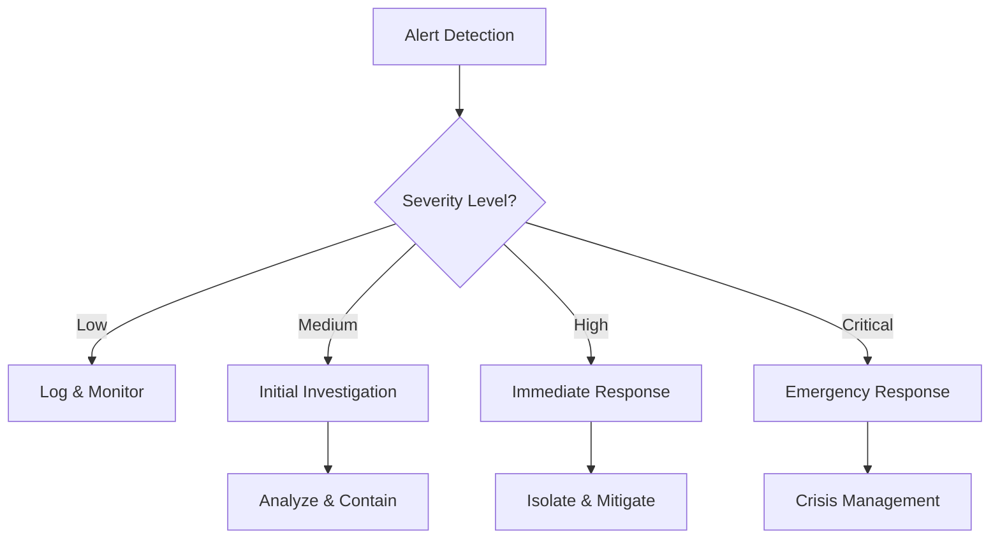

# 🛡️ Panduan Monitoring Keamanan Jaringan

## 📋 Security Monitoring Framework

### 1. Security Information and Event Management (SIEM)
```
[Architecture]
                    +----------------+
                    |   Dashboard    |
                    |    (Kibana)   |
                    +----------------+
                           ↑
                    +----------------+
                    | Elasticsearch  |
                    +----------------+
                           ↑
              +------------------------+
              |       Logstash        |
              +------------------------+
                 ↑      ↑        ↑
        +--------+      |        +--------+
        |               |                 |
  +-----------+  +-----------+    +-----------+
  |  Firewall |  |   NGFW   |    |   VPN    |
  |   Logs    |  |   Logs   |    |   Logs   |
  +-----------+  +-----------+    +-----------+
```

## 🔍 Security Monitoring Components

### 1. Log Collection Sources
- Palo Alto NGFW
  ```
  - Threat logs
  - Traffic logs
  - System logs
  - Configuration logs
  ```

- VPN Monitoring
  ```
  - Connection status
  - Authentication logs
  - Bandwidth usage
  - Split tunneling events
  ```

- Network Access Control
  ```
  - Authentication events
  - Policy violations
  - Device compliance
  - Access attempts
  ```

### 2. Security Alert Configuration
```yaml
# security_alerts.yml
rules:
  - name: "Brute Force Detection"
    condition:
      timeframe: 5m
      threshold: 10
      event: "Authentication Failure"
    severity: High
    action: 
      - notify_security_team
      - block_source_ip

  - name: "Malware Detection"
    condition:
      event: "Threat Detection"
      threat_level: "Critical"
    severity: Critical
    action:
      - isolate_host
      - notify_security_team
      - create_incident
```

## 🚨 Incident Response Procedures

### 1. Security Incident Levels
```
Level 1 (Low):
- Minor policy violations
- Single failed login attempts
- Non-critical system alerts

Level 2 (Medium):
- Multiple failed logins
- Suspicious traffic patterns
- Policy violations

Level 3 (High):
- Confirmed malware
- Data breach attempts
- DDoS attacks

Level 4 (Critical):
- Active breach
- Data exfiltration
- System compromise
```

### 2. Response Workflow


## 📊 Security Dashboards

### 1. Security Overview Dashboard
```
+------------------------+----------------------+
|    Threat Timeline    |   Security Score    |
| [Timeline Chart]      | [Gauge Chart]       |
+------------------------+----------------------+
|    Policy Violations  |   Active Threats    |
| [Table]              | [Alert List]        |
+------------------------+----------------------+
|    Geographic Traffic | Authentication Stats |
| [World Map]          | [Bar Chart]         |
+------------------------+----------------------+
```

### 2. Compliance Monitoring
```yaml
compliance_checks:
  - name: "Firewall Policy Audit"
    frequency: Daily
    checks:
      - policy_consistency
      - rule_optimization
      - unused_rules
      - risky_configurations

  - name: "Access Control Review"
    frequency: Weekly
    checks:
      - privilege_review
      - account_status
      - password_policy
      - access_patterns
```

## 🔄 Security Monitoring Workflow

### 1. Real-time Monitoring
```
1. Data Collection
   [ ] Log aggregation
   [ ] Event correlation
   [ ] Real-time analysis
   [ ] Threat intelligence

2. Analysis
   [ ] Pattern recognition
   [ ] Anomaly detection
   [ ] Behavior analysis
   [ ] Context enrichment

3. Response
   [ ] Alert generation
   [ ] Incident creation
   [ ] Automated response
   [ ] Team notification
```

### 2. Periodic Assessment
```
Daily Tasks:
[ ] Review critical alerts
[ ] Check security logs
[ ] Monitor active threats
[ ] Verify system health

Weekly Tasks:
[ ] Security report review
[ ] Threat hunting
[ ] Policy compliance check
[ ] Performance analysis

Monthly Tasks:
[ ] Security assessment
[ ] Policy review
[ ] System updates
[ ] Threat landscape review
```

## 📈 Security Metrics

### 1. Key Performance Indicators
```
1. Detection Metrics
   - Mean Time to Detect (MTTD)
   - False Positive Rate
   - Detection Coverage
   - Alert Accuracy

2. Response Metrics
   - Mean Time to Respond (MTTR)
   - Incident Resolution Time
   - Response Effectiveness
   - Recovery Time
```

### 2. Reporting Templates
```
Daily Security Report:
- Critical Incidents: [Count]
- Active Threats: [List]
- Policy Violations: [Summary]
- System Health: [Status]

Weekly Security Summary:
- Incident Trends
- Policy Compliance
- System Updates
- Recommendations

Monthly Security Review:
- Security Posture
- Risk Assessment
- Compliance Status
- Improvement Plans
```

## 🔐 Best Practices

### 1. Monitoring Configuration
- Implement defense in depth
- Enable comprehensive logging
- Use correlation rules
- Regular configuration review

### 2. Alert Management
- Define clear thresholds
- Implement alert prioritization
- Maintain response procedures
- Regular alert tuning

### 3. Incident Response
- Document all incidents
- Follow response procedures
- Regular team training
- Post-incident review

## 📚 Documentation Requirements

### 1. Incident Documentation
```
Incident Report Template:
- Incident ID
- Severity Level
- Detection Time
- Response Actions
- Resolution Status
- Root Cause
- Lessons Learned
```

### 2. Change Management
```
Security Change Template:
- Change ID
- Type of Change
- Risk Assessment
- Implementation Plan
- Rollback Plan
- Verification Steps
```

## 🎯 Success Criteria
1. Detection Capability
   - 100% logging coverage
   - <1% false positive rate
   - <15min detection time

2. Response Efficiency
   - <30min response time
   - <2hr resolution time
   - 100% incident documentation

3. Compliance
   - 100% policy compliance
   - Regular audits passed
   - Updated documentation